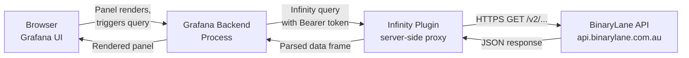

# How It Works

The BinaryLane Grafana integration uses the
[Infinity datasource plugin](https://grafana.com/grafana/plugins/yesoreyeram-infinity-datasource/)
to query the BinaryLane REST API directly from Grafana — no agent, no exporter, no
intermediate database.

## Architecture

**Key point:** Infinity is a *server-side proxy*. The HTTP requests to the BinaryLane API
are made by your Grafana backend process, not by the user's browser. This means:

- The API token never leaves your Grafana server
- CORS is not a concern
- The BinaryLane API must be reachable from your Grafana host (not the user's machine)

## Authentication

Authentication is configured once at the datasource level using a Bearer token.
Individual panel queries do not include auth headers — Infinity adds the token
automatically to every proxied request.

The token has full account access. Treat it like a password. See
[02-setup.md](02-setup.md) for how to generate one.

## Backend parser vs frontend parser

Infinity has two JSON parsers. **Always use the backend parser** for BinaryLane data.

| | Backend parser | Frontend parser |
|---|---|---|
| Runs in | Grafana server process | User's browser |
| Auth | Injected automatically | Not injected |
| Nested field access | Dot notation (`networks.v4.0.ip_address`) | Dot or bracket |
| Bracket notation | **Not supported** | Supported |
| Performance | Better for large responses | Fine for small |

To select it: in any panel's Infinity query config, set **Parser → Backend**.

## BinaryLane API basics

- Base URL: `https://api.binarylane.com.au`
- All endpoints are under `/v2/`
- All responses are JSON
- Paginated endpoints return a wrapper object containing an array plus metadata
- Maximum `per_page` is **200** — you cannot retrieve more than 200 items per request
- Time-series data (`/v2/samplesets`) uses ISO 8601 datetimes for `start`/`end` params

## What the API does not provide

- No WebSocket or streaming endpoints — all data is request/response
- No push notifications or webhooks (relevant to Grafana alerting — see [08-limitations.md](08-limitations.md))
- Minimum time-series resolution is 5 minutes — there is no real-time data
