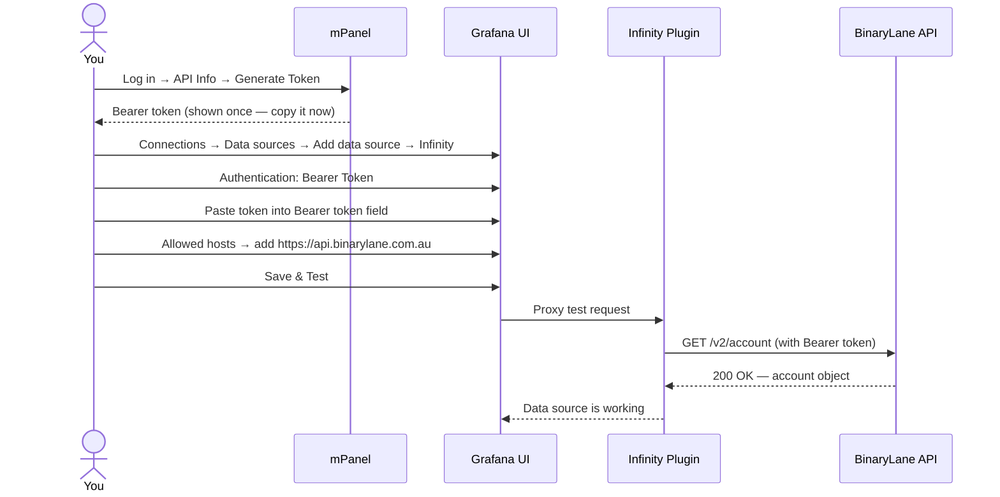

# Setup

## Generating an API token

1. Log in to [mPanel](https://home.binarylane.com.au)
2. Click your name (top right) → **API Info**
3. Click **Generate New Token**
4. Copy the token — it will not be shown again

The token grants full account access. Store it in a secret manager or environment
variable — never commit it to source control.

## Provisioning flow



## Option A — Docker Compose (quickest)

Clone this repo and create a `.env` file:

```bash
cp .env.example .env
# Edit .env and set BL_API_TOKEN=your-token-here
```

Start the stack:

```bash
docker compose up -d
```

Open [http://localhost:3000](http://localhost:3000) — login `admin` / `admin` (change
this before exposing to a network). The Infinity datasource and all four dashboards
are provisioned automatically on first boot.

**Before exposing to a network**, set strong admin credentials by adding these to your
`.env` and restarting:

```bash
GF_SECURITY_ADMIN_USER=youradmin
GF_SECURITY_ADMIN_PASSWORD=a-strong-password
```

## Option B — Manual install into existing Grafana

### 1. Install the Infinity plugin

```bash
grafana-cli plugins install yesoreyeram-infinity-datasource
systemctl restart grafana-server
```

Or in Docker, add to `GF_INSTALL_PLUGINS`:

```yaml
environment:
  GF_INSTALL_PLUGINS: yesoreyeram-infinity-datasource
```

### 2. Provision the datasource

Copy `provisioning/datasources/binarylane.yaml` to your Grafana provisioning directory
and set `BL_API_TOKEN` in your environment before restarting Grafana:

```bash
cp provisioning/datasources/binarylane.yaml /etc/grafana/provisioning/datasources/
export BL_API_TOKEN=your-token-here
systemctl restart grafana-server
```

Or configure manually in the UI:
- **Connections → Data sources → Add new → Infinity**
- Name: `BinaryLane`
- Authentication: `Bearer Token`
- Token: your API token
- Allowed hosts: `https://api.binarylane.com.au`
- Save & Test

### 3. Import dashboards

```bash
cp provisioning/dashboards/binarylane.yaml /etc/grafana/provisioning/dashboards/
cp dashboards/*.json /var/lib/grafana/dashboards/
systemctl restart grafana-server
```

Or import each JSON via **Dashboards → Import → Upload JSON file**.

## Testing your connection

After setup, verify the datasource works with a quick manual query:

1. Open the Infinity datasource → **Explore**
2. Set: Type = JSON, Source = URL
3. URL: `https://api.binarylane.com.au/v2/account`
4. Root selector: `account`
5. Parser: Backend
6. Click **Run query**

You should see your account fields (`email`, `status`, etc.) in the result table.

If you get an error, check:
- Token is correct: `curl -H "Authorization: Bearer YOUR_TOKEN" https://api.binarylane.com.au/v2/account`
- Allowed hosts includes `https://api.binarylane.com.au` (exact string, with protocol)
- Your Grafana host has outbound HTTPS access to `api.binarylane.com.au`
