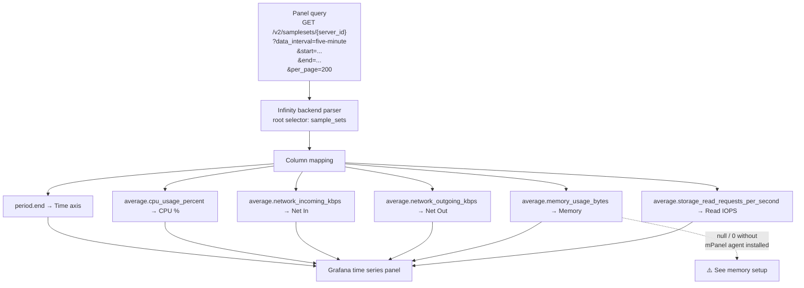

# Server Metrics

Per-server performance data comes from the `/v2/samplesets/{server_id}` endpoint.
It provides time-averaged CPU, network, storage, memory, and disk metrics.

## What you can monitor

| Metric | API field | Notes |
|--------|-----------|-------|
| CPU usage | `average.cpu_usage_percent` | Avg across all vCPUs; 100% = fully saturated |
| Network in | `average.network_incoming_kbps` | Inbound kbps |
| Network out | `average.network_outgoing_kbps` | Outbound kbps |
| Disk read throughput | `average.storage_read_kbps` | kbps |
| Disk write throughput | `average.storage_write_kbps` | kbps |
| Disk read IOPS | `average.storage_read_requests_per_second` | Requests/s |
| Disk write IOPS | `average.storage_write_requests_per_second` | Requests/s |
| Memory usage | `average.memory_usage_bytes` | **Requires mPanel agent — see below** |
| Peak memory | `maximum_memory_megabytes` | Highest MB in the sample period |
| Peak disk | `maximum_storage_gigabytes` | Highest GB in the sample period |
| Sample period end | `period.end` | Timestamp — use as the time axis |

## How the data flows



## Building a time series panel

In a new panel, set the datasource to **BinaryLane**, then configure the Infinity query:

| Field | Value |
|-------|-------|
| Type | JSON |
| Source | URL |
| Format | Time series |
| URL | `https://api.binarylane.com.au/v2/samplesets/${server_id}?data_interval=${resolution}&start=${__from:date:iso}&end=${__to:date:iso}&per_page=200` |
| Root selector | `sample_sets` |
| Parser | Backend |

Add columns:

| Selector | As (column name) | Type |
|----------|-----------------|------|
| `period.end` | Time | Timestamp |
| `average.cpu_usage_percent` | CPU % | Number |
| `average.network_incoming_kbps` | Net In | Number |
| `average.network_outgoing_kbps` | Net Out | Number |
| `average.storage_read_kbps` | Disk Read | Number |
| `average.storage_write_kbps` | Disk Write | Number |
| `average.storage_read_requests_per_second` | Read IOPS | Number |
| `average.storage_write_requests_per_second` | Write IOPS | Number |
| `average.memory_usage_bytes` | Memory | Number |

The `${server_id}` and `${resolution}` references are Grafana template variables —
see [07-variables-filters.md](07-variables-filters.md) for how to set these up.

## Understanding resolution and the 200-sample cap

The `data_interval` parameter controls the time granularity of each data point.
The API returns at most **200 samples per request** (`per_page=200`). This creates
a fixed time window for each resolution setting:

| `data_interval` | Sample interval | 200 samples covers |
|-----------------|-----------------|-------------------|
| `five-minute` | 5 minutes | ~16.7 hours |
| `half-hour` | 30 minutes | ~4.2 days |
| `four-hour` | 4 hours | ~33 days |
| `day` | 1 day | ~6.7 months |
| `week` | 1 week | ~3.8 years |

**If your Grafana time range is wider than the coverage for your chosen resolution,
the panel will only show data for the first portion of the range.** There is no
automatic pagination — you get one page of 200.

Suggested combinations:

| Grafana time range | Use resolution |
|--------------------|---------------|
| Last 1–12 hours | `five-minute` |
| Last 1–4 days | `half-hour` |
| Last 2–5 weeks | `four-hour` |
| Last 3–6 months | `day` |
| Historical | `week` |

## Memory metrics — mPanel agent required

`average.memory_usage_bytes` will be `null` or `0` for every sample unless the
**mPanel Memory Graph** agent is installed on the server. The agent runs a cron job
every few minutes and sends a UDP packet on port 21000 to BinaryLane's collection endpoint.

### Install on Linux

```bash
wget http://mirror.binarylane.com.au/tools/mpanel-memory-graph.tar.gz
sudo tar xfv mpanel-memory-graph.tar.gz -C /
rm mpanel-memory-graph.tar.gz
```

**Debian 12 only** — cron is not in the base image:

```bash
sudo apt install cron
sudo systemctl enable --now cron
```

If you have iptables rules blocking outbound traffic:

```bash
iptables -I OUTPUT -p udp --dport 21000 -j ACCEPT
iptables-save > /etc/iptables/rules.v4
```

### Install on Windows

1. Download [mPanelMemoryGraph.msi](http://mirror.binarylane.com.au/tools/mpanelmemorygraph.msi)
2. Requires .NET Framework 2.0+
3. Run the installer — creates a Windows service

Firewall rule:
```
netsh advfirewall firewall add rule name="mPanel Memory Graph" action=allow dir=out protocol=UDP remoteport=21000
```

Allow up to 15 minutes for data to appear after installation.

### Verify

```bash
systemctl status cron
ls -la /usr/local/bin/mpanel-memory-graph /etc/cron.d/mpanel-memory-graph
sudo /usr/local/bin/mpanel-memory-graph
```

## Limitations

- **5-minute minimum resolution.** There is no finer-grained data. Dashboard refresh
  intervals shorter than 5 minutes will not produce new data.
- **200 samples per query, no automatic pagination.** If you need data beyond what
  200 samples at a given resolution covers, you must switch to a coarser resolution.
  There is no workaround for seeing both high resolution and a long time range
  simultaneously.
- **Memory requires the mPanel agent.** Without it, all memory panels show no data.
  This cannot be worked around — the metric simply does not exist in the API without
  the agent reporting it.
- **No per-core CPU breakdown.** `cpu_usage_percent` is the average across all vCPUs.
  Individual core metrics are not available.
- **No disk space time series.** `maximum_storage_gigabytes` gives the peak for a
  sample period, not a continuous time series of disk utilisation. Historical disk
  growth cannot be charted.
