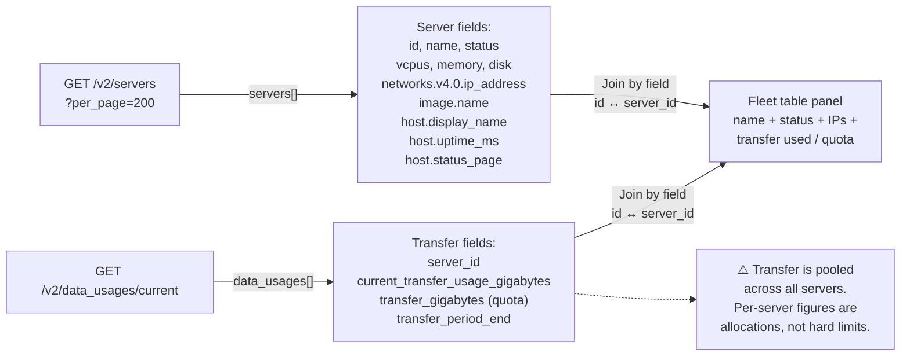

# Fleet Overview

The fleet overview uses two endpoints: `/v2/servers` for inventory and
`/v2/data_usages/current` for transfer usage across all servers.

## What you can monitor

- All servers in the account: name, status, vCPUs, RAM, disk, OS, IP addresses
- Host-level metadata: display name, uptime, maintenance status page URL
- Current period data transfer usage and quota per server
- Account-wide totals: vCPU count, total RAM, total disk, total transfer

## How the data flows



## Building the server inventory panel

Configure an Infinity query:

| Field | Value |
|-------|-------|
| Type | JSON |
| Source | URL |
| Format | Table |
| URL | `https://api.binarylane.com.au/v2/servers?per_page=200` |
| Root selector | `servers` |
| Parser | Backend |

Add columns:

| Selector | As | Type |
|----------|----|------|
| `id` | ID | Number |
| `name` | Name | String |
| `status` | Status | String |
| `vcpus` | vCPUs | Number |
| `memory` | RAM (MB) | Number |
| `disk` | Disk (GB) | Number |
| `image.name` | OS | String |
| `networks.v4.0.ip_address` | IP | String |
| `host.display_name` | Host | String |
| `host.uptime_ms` | Host Uptime | Number |
| `host.status_page` | Maintenance | String |

> **Important:** Use dot notation for nested fields (`networks.v4.0.ip_address`).
> Bracket notation (`networks[v4][0]`) is not supported by the Infinity backend parser.

`host.status_page` is non-null only when the host is under maintenance — you can use
a cell colour override (non-empty = yellow) as a visual maintenance indicator.

## Building the transfer usage panel

Add a second query target (or a separate panel) for transfer data:

| Field | Value |
|-------|-------|
| Type | JSON |
| Source | URL |
| Format | Table |
| URL | `https://api.binarylane.com.au/v2/data_usages/current` |
| Root selector | `data_usages` |
| Parser | Backend |

Columns:

| Selector | As | Type |
|----------|----|------|
| `server_id` | ID | Number |
| `current_transfer_usage_gigabytes` | Used GB | Number |
| `transfer_gigabytes` | Quota GB | Number |
| `transfer_period_end` | Period End | String |

To calculate transfer percentage, add a **Calculate field** transform:

```
Mode:   Binary operation
Left:   Used GB
Op:     /
Right:  Quota GB
Alias:  Transfer %
```

Then a second **Calculate field** transform to multiply by 100 for display.

## Joining server names to transfer data

Use the **Join by field** transformation to merge the two query results into one table.
Both queries must be in the same panel as separate targets (A and B):

```
Transform: Join by field
Field:     ID        (present in both — servers.id and data_usages.server_id)
Mode:      OUTER     (keeps servers with no transfer data)
```

This gives you a single table with name, status, IPs, and transfer figures side by side.

## Understanding transfer pooling

BinaryLane pools data transfer across all servers in your account. A server that uses
less than its allocated quota offsets one that exceeds it. The per-server
`transfer_gigabytes` figure is an *allocation*, not a hard cap — exceeding it does not
immediately incur charges if other servers in the pool have spare capacity.

The `current_transfer_usage_gigabytes` figure reflects actual usage for the current
billing period. The pool resets at the start of each period.

## Limitations

- **No historical inventory.** There is no API endpoint for server state at a past
  point in time. You can only see the current state of your fleet.
- **No load balancer metrics.** Load balancers appear in `/v2/load_balancers` but have
  no equivalent of the samplesets endpoint — only configuration data (rules, target
  servers) is available, not traffic or health metrics.
- **IP address field is `networks.v4.0.ip_address`.** This assumes the first IPv4
  address. Servers with multiple IPv4 addresses will only show the first. Failover IPs
  are in a separate `failover_ips[]` array and require a separate query or transformation
  to display.
- **`host.status_page` is a URL, not a boolean.** It is `null` when there is no
  maintenance, and a URL string during maintenance events. Use "is not null" cell
  overrides rather than a boolean check.
- **Transfer pooling means per-server % > 100 is normal** if a server is using more
  than its allocation but the pool has spare capacity. Do not alert on per-server
  transfer % alone without accounting for pool state.
