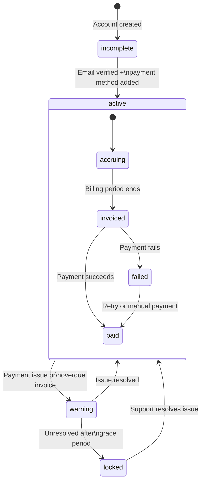

# Billing & Account

The billing area covers account status, available credit, current unbilled charges,
and invoice history. All billing data is read-only — you can monitor and alert on it
but not modify it through Grafana.

## What you can monitor

- Account status (active / warning / locked / incomplete)
- 2FA enabled/disabled (security signal)
- Available credit balance (AU$)
- Unbilled total for the current period (AU$)
- Itemised unbilled charges (description, amount, ongoing vs pending)
- Invoice history (amounts, tax, paid status, payment failure count, PDF links)
- Failed invoice count (blocks new service creation when > 0)

## Account status lifecycle

**`warning` and `locked` are urgent states** — locked accounts cannot create new
services. If your billing dashboard shows either of these, contact BinaryLane support.

## Building the account status panel

Use a Stat panel with a Threshold colour override:

| Field | Value |
|-------|-------|
| Type | JSON |
| Source | URL |
| Format | Table |
| URL | `https://api.binarylane.com.au/v2/account` |
| Root selector | `account` |
| JSON options | Root is not array: ✓ |
| Parser | Backend |

Columns to extract:

| Selector | As | Type |
|----------|----|------|
| `status` | Status | String |
| `two_factor_authentication_enabled` | 2FA | Boolean |
| `email` | Email | String |
| `email_verified` | Email Verified | Boolean |

For the Status Stat panel, add value mappings:
- `active` → green
- `incomplete` → yellow
- `warning` → orange
- `locked` → red

## Building the balance panel

| Field | Value |
|-------|-------|
| URL | `https://api.binarylane.com.au/v2/customers/my/balance` |
| Root selector | `balance` |
| JSON options | Root is not array: ✓ |
| Parser | Backend |

Key columns:

| Selector | As | Type |
|----------|----|------|
| `unbilled_total` | Unbilled (AU$) | Number |
| `available_credit` | Credit (AU$) | Number |
| `generated_at` | As of | String |

For the Unbilled stat panel, add thresholds:
- Base: green
- > 50: yellow
- > 200: red

Adjust these thresholds to match your typical spend.

## Building the unbilled charges table

The `charges[]` array is nested inside the balance response. Add a second query target
pointing to the same URL with root selector `balance.charges`:

| Field | Value |
|-------|-------|
| URL | `https://api.binarylane.com.au/v2/customers/my/balance` |
| Root selector | `balance.charges` |
| Parser | Backend |

Columns:

| Selector | As | Type |
|----------|----|------|
| `description` | Description | String |
| `total` | Amount (AU$) | Number |
| `ongoing` | Ongoing | Boolean |
| `created` | Created | String |

`ongoing: true` means the service is still running (charge will grow).
`ongoing: false` means the service ended and the charge is awaiting invoicing.

## Building the invoice history table

| Field | Value |
|-------|-------|
| URL | `https://api.binarylane.com.au/v2/customers/my/invoices?per_page=200` |
| Root selector | `invoices` |
| Parser | Backend |

Key columns:

| Selector | As | Type |
|----------|----|------|
| `invoice_number` | Invoice # | String |
| `amount` | Amount (AU$) | Number |
| `tax` | GST (AU$) | Number |
| `paid` | Paid | Boolean |
| `payment_failure_count` | Failures | Number |
| `created` | Created | String |
| `date_due` | Due | String |
| `invoice_download_url` | PDF | String |

Use a cell override on `invoice_download_url` to render it as a clickable link.

> **PDF links expire 24 hours after the API responds.** Refresh the panel to get a
> fresh link. Do not bookmark or store these URLs.

## Detecting failed invoices

Use a separate Stat panel querying the failed invoices endpoint:

| Field | Value |
|-------|-------|
| URL | `https://api.binarylane.com.au/v2/customers/my/unpaid-payment-failed-invoices` |
| Root selector | `invoices` |
| Parser | Backend |

Count the rows using a **Reduce** transformation (Count). Add a threshold:
- 0: green
- > 0: red

Failed invoices block new service creation. A non-zero count warrants immediate attention.

## Limitations

- **No Grafana alerting from billing data.** Infinity query results cannot directly
  trigger Grafana alerts. You can see the billing state on a dashboard but cannot
  configure "alert me when unbilled_total exceeds $X" via native Grafana alerting.
  Workaround: use a Grafana alert on a panel value if you have Grafana Cloud or
  an alerting backend, but this requires additional setup outside this stack.
- **Invoice PDF URLs expire in 24 hours.** These are pre-signed URLs generated at
  query time. There is no persistent link to invoices.
- **No payment method details.** `configured_payment_methods[]` is present in the
  account response but contains only method type (e.g. "card"), not card numbers
  or expiry dates.
- **No billing history before invoicing.** The charges array shows the *current period*
  only. Previous period charges exist as invoices, not as the granular charges array.
- **`unbilled_total` updates with a short delay.** It is not a real-time figure —
  BinaryLane recalculates it periodically. Very recent charges may not be reflected
  immediately.
