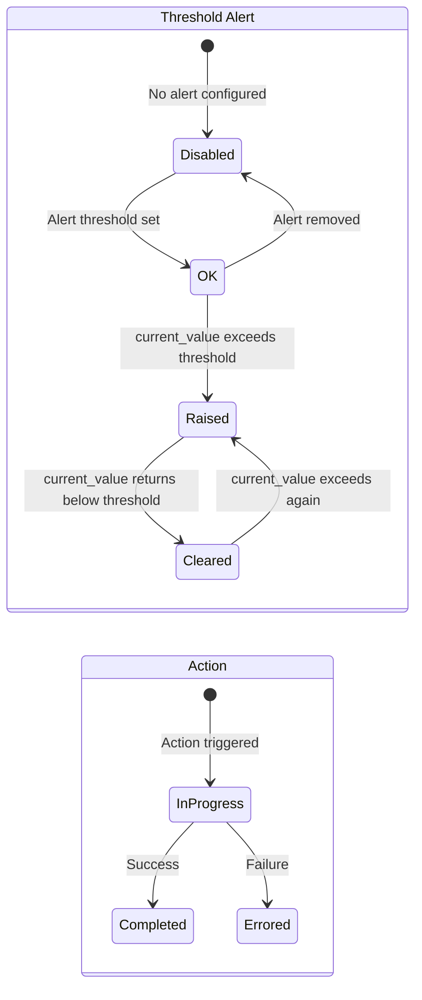

# Alerts & Actions

## Threshold alerts

BinaryLane threshold alerts are configured per server and trigger when a metric
exceeds a set value. The API exposes current alert state — not a history of events.

### Alert types

| Type | Measures | Unit | Common use |
|------|----------|------|------------|
| `cpu` | Avg CPU % | % (0–100) | Sustained load detection |
| `storage-requests` | Avg combined IOPS | requests/s | Swap thrashing (high IOPS + memory exhaustion) |
| `network-incoming` | Inbound bandwidth | kbps | Possible DoS |
| `network-outgoing` | Outbound bandwidth | kbps | Possible compromise or spam |
| `data-transfer-used` | Monthly transfer used | % of quota | Billing protection |
| `storage-used` | Disk used | % of total | Full disk prevention |
| `memory-used` | Virtual memory used | % of RAM | > 100% = swap in use |

### Alert and action state lifecycle



### The two-endpoint alert model

There are two alert endpoints and you need both to build a useful panel:

| Endpoint | Returns | Use for |
|----------|---------|---------|
| `/v2/servers/threshold_alerts` | Array of `server_ids` (integers) | Count of servers currently breaching any alert |
| `/v2/servers/{id}/threshold_alerts` | Full alert details per server | Per-server alert type, threshold, current value, timestamps |

The first endpoint returns *only IDs* — no alert details, no metric values. To show
which alerts are active and for which servers, you must query the per-server endpoint
for each server, then join the results.

### Building the "servers exceeding alerts" stat panel

| Field | Value |
|-------|-------|
| URL | `https://api.binarylane.com.au/v2/servers/threshold_alerts` |
| Root selector | `server_ids` |
| Parser | Backend |

Use a **Reduce** transformation (Count) and add a threshold: 0 = green, > 0 = red.

### Building the per-server threshold alerts table

Use the `${server_id}` variable (see [07-variables-filters.md](07-variables-filters.md)):

| Field | Value |
|-------|-------|
| URL | `https://api.binarylane.com.au/v2/servers/${server_id}/threshold_alerts` |
| Root selector | `threshold_alerts` |
| Parser | Backend |

Columns:

| Selector | As | Type |
|----------|----|------|
| `alert_type` | Type | String |
| `enabled` | Enabled | Boolean |
| `value` | Threshold | Number |
| `current_value` | Current | Number |
| `last_raised` | Last Raised | String |
| `last_cleared` | Last Cleared | String |

Add a cell colour override: rows where `current_value` > `value` → red.

---

## Actions (audit log)

Actions record every operation performed on your account — server creation, resizing,
reboots, image creation, and more. They also track in-progress operations with a
progress percentage.

### Action status values

| Status | Meaning |
|--------|---------|
| `in-progress` | Operation running — check `progress.percent_complete` |
| `completed` | Operation finished successfully |
| `errored` | Operation failed — check `result_data` for reason |

### Building the recent actions table

| Field | Value |
|-------|-------|
| URL | `https://api.binarylane.com.au/v2/actions?per_page=200` |
| Root selector | `actions` |
| Parser | Backend |

Columns:

| Selector | As | Type |
|----------|----|------|
| `id` | ID | Number |
| `type` | Type | String |
| `status` | Status | String |
| `title` | Title | String |
| `resource_type` | Resource | String |
| `started_at` | Started | String |
| `completed_at` | Completed | String |
| `progress.percent_complete` | Progress % | Number |

Add a cell override on `status`:
- `in-progress` → blue
- `completed` → green
- `errored` → red

For in-progress actions, `progress.percent_complete` gives a 0–100 value you can
render as an inline bar using the **Bar gauge** cell display mode.

### Per-server actions

To show actions for only the selected server, use:

```
URL: https://api.binarylane.com.au/v2/servers/${server_id}/actions?per_page=200
Root selector: actions
```

Same column setup as the account-wide actions table.

---

## Limitations

- **No alert history.** The threshold alerts API returns only the *current* state —
  `last_raised` and `last_cleared` timestamps are the only historical data. There is
  no event log of alert transitions. You cannot chart "how many times did this server
  breach CPU threshold this week."
- **No push notifications from Grafana.** Alert state is pulled on each dashboard
  refresh. There is no way to have Grafana send a notification when an alert is raised
  without additional tooling (e.g., polling via external script or Grafana alerting
  rules on panel values).
- **Cross-server alert joining is manual.** The `/v2/servers/threshold_alerts` endpoint
  gives you a list of server IDs. Getting the details requires one API call per server.
  Infinity cannot fan out one query into N sub-queries. Workaround: the per-server
  threshold alerts table uses a server selector variable — you check one server at a time.
- **Actions are limited to 200 per query.** For accounts with high action volume,
  the audit log panel will only show the most recent 200 actions. There is no
  pagination within a single Infinity query.
- **`result_data` field is unstructured.** The content varies by action type and is
  not consistently parseable as a column value. Treat it as a freetext detail field.
