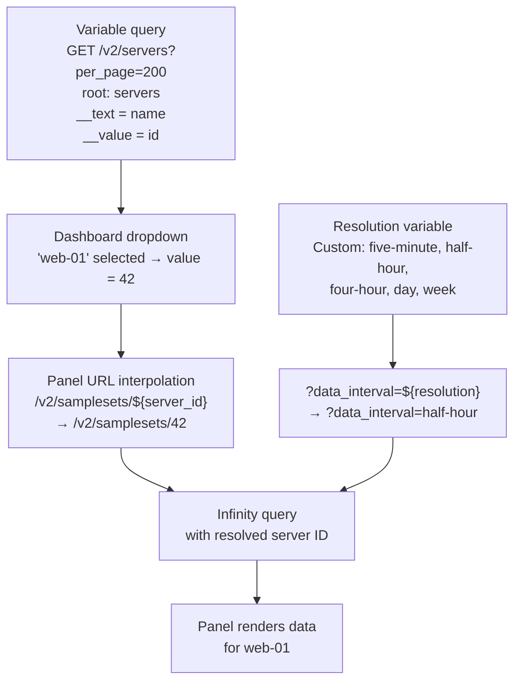

# Variables, Filters & Transformations

## Dashboard variables

Grafana template variables let you build panels that adapt to user selection —
for example, switching between servers without duplicating panels.

### How variables feed into panel URLs



### Server dropdown variable

Create a new dashboard variable:

| Setting | Value |
|---------|-------|
| Type | Query |
| Name | `server_id` |
| Data source | BinaryLane |
| Query type | JSON |
| Source | URL |
| URL | `https://api.binarylane.com.au/v2/servers?per_page=200` |
| Root selector | `servers` |
| Parser | Backend |

Add two columns:

| Selector | Column name | Type |
|----------|-------------|------|
| `name` | `__text` | String |
| `id` | `__value` | String |

`__text` is the label shown in the dropdown. `__value` is the value injected into
panel URLs as `${server_id}`. This is an Infinity convention (Infinity ≥ 2.x required).

### Resolution variable

Create a second variable:

| Setting | Value |
|---------|-------|
| Type | Custom |
| Name | `resolution` |
| Values | `five-minute : 5 Minutes, half-hour : 30 Minutes, four-hour : 4 Hours, day : 1 Day, week : 1 Week` |

The format is `value : label` pairs. The `value` half is what gets injected into the
panel URL as `${resolution}`. Set the default to `five-minute` or `half-hour` depending
on your typical time range.

---

## Infinity filter syntax

Infinity's backend parser supports client-side filtering of JSON responses. Filters
apply after the API responds — they do not change the API request.

```json
"filters": [
  { "field": "status", "operator": "equals",   "value": "active" },
  { "field": "status", "operator": "equals",   "value": "in-progress" }
]
```

### Supported operators

| Operator | Behaviour |
|----------|-----------|
| `equals` | Exact match |
| `not_equals` | Exclude exact match |
| `contains` | Substring match |
| `not_contains` | Exclude substring match |
| `starts_with` | Prefix match |
| `ends_with` | Suffix match |

### OR vs AND

Multiple filters on the same Infinity target are **OR'd** together. The example above
returns rows where status is `active` OR `in-progress`.

For AND logic (rows where field A equals X AND field B equals Y), you need two
separate Infinity targets plus a **Join by field** or **Filter by value** Grafana
transformation.

---

## Common Grafana transformations

### Calculate transfer percentage

The BinaryLane API returns raw GB values. To calculate a percentage:

1. Add **Calculate field** transformation:
   - Mode: Binary operation
   - Left field: `Used GB`
   - Operation: `/`
   - Right field: `Quota GB`
   - Alias: `Transfer Ratio`

2. Add a second **Calculate field** transformation:
   - Mode: Binary operation
   - Left field: `Transfer Ratio`
   - Operation: `*`
   - Right: 100 (constant)
   - Alias: `Transfer %`

### Join server names to other datasets

Any dataset that contains a `server_id` column can be joined to the servers list
(which has `id` and `name`) using **Join by field**:

| Setting | Value |
|---------|-------|
| Field | `id` (from servers query) |
| Mode | OUTER (keeps rows without a match) |

This merges the two data frames on matching server ID, giving you `name` alongside
whatever the second dataset provides (transfer usage, alert state, etc.).

### Filter in-progress actions

To show only in-progress actions in a panel, add a **Filter by value** transformation:

| Setting | Value |
|---------|-------|
| Field | `status` |
| Type | Filter by value |
| Match | equals |
| Value | `in-progress` |

---

## Limitations

- **Infinity filters are client-side.** They filter the response Grafana has already
  received — they do not add query parameters to the API request. You always fetch all
  results (up to `per_page=200`) and filter locally. This is fine for most BL datasets,
  which are small.
- **Variable queries count as API calls.** Each variable refresh (on dashboard load or
  time range change) triggers an API request to populate the dropdown. With many
  variables and frequent refresh, this adds up. Keep variable queries to what you need.
- **`__text` / `__value` require Infinity ≥ 2.x.** Older versions of the plugin use
  different column name conventions for variable mapping. If your dropdown shows raw
  JSON instead of server names, check your plugin version.
