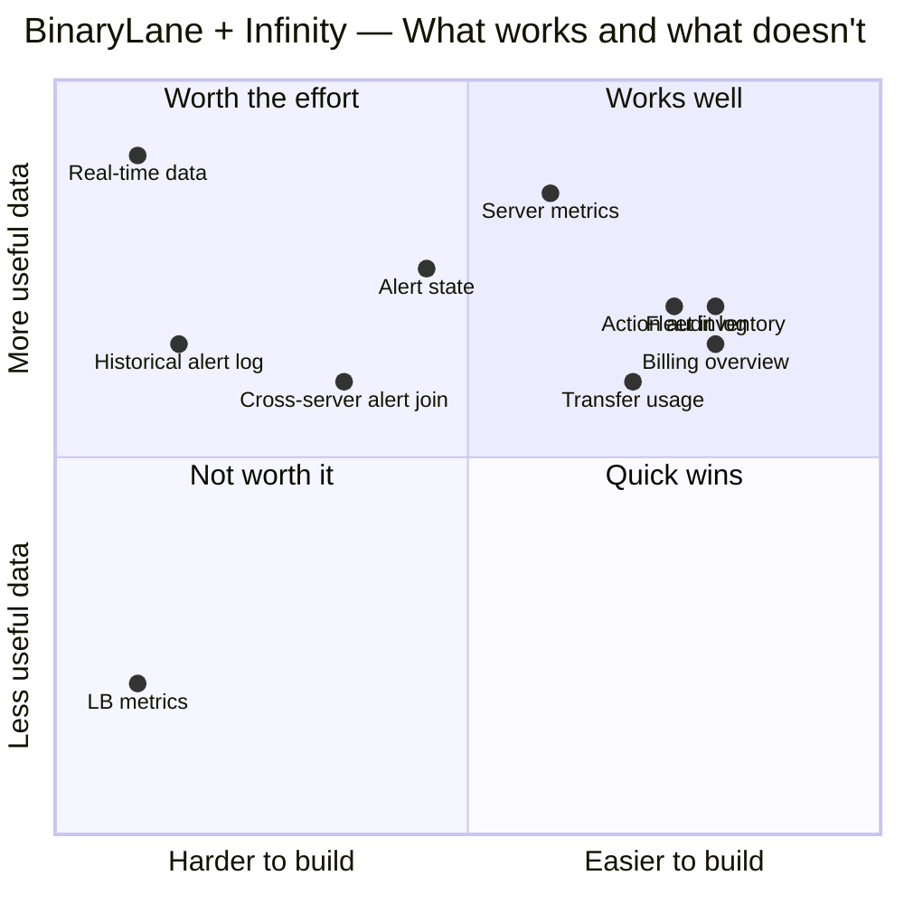

# Limitations

A consolidated reference of every known constraint when using the BinaryLane API
with Grafana Infinity. Each entry links to the relevant tutorial for context.

## Capability overview

---

## Performance metrics

| Constraint | Detail | Workaround |
|------------|--------|------------|
| **5-minute minimum resolution** | The finest `data_interval` is `five-minute`. Refreshing more frequently produces no new data. | Set refresh intervals to 5m or longer. |
| **200 samples per query** | `per_page=200` is the API maximum. You cannot retrieve more data points in a single request. | Switch to a coarser `data_interval` to cover a wider time range. See [resolution table](03-server-metrics.md#understanding-resolution-and-the-200-sample-cap). |
| **No automatic pagination** | Infinity sends one request per panel query. There is no built-in way to paginate across multiple pages. | Coarser resolution is the only option for wide time ranges. |
| **Memory requires mPanel agent** | `average.memory_usage_bytes` is null/0 without the agent installed and reporting. | Install the [mPanel Memory Graph agent](03-server-metrics.md#memory-metrics--mpanel-agent-required) on each server. |
| **No per-core CPU** | Only average CPU across all vCPUs is available. | Not available in the API. |
| **No disk usage time series** | Disk usage is not tracked as a continuous time series. Only `maximum_storage_gigabytes` per sample period is available. | Not available in the API. |

---

## Fleet

| Constraint | Detail | Workaround |
|------------|--------|------------|
| **No historical inventory** | `/v2/servers` returns current state only. You cannot query what your fleet looked like last month. | Not available in the API. |
| **No load balancer metrics** | `/v2/load_balancers` returns configuration only — no traffic, health, or connection data. | Not available in the API. |
| **Single IPv4 shown** | `networks.v4.0.ip_address` returns the first IPv4 only. Failover IPs require a separate query against `failover_ips[]`. | Add a second Infinity target for failover IPs and join. |
| **Transfer pooling** | Per-server transfer % can exceed 100 legitimately if the pool has spare capacity. | Show raw GB figures alongside percentage. See [transfer pooling](04-fleet-overview.md#understanding-transfer-pooling). |

---

## Billing

| Constraint | Detail | Workaround |
|------------|--------|------------|
| **No Grafana alerting** | Infinity query results cannot natively trigger Grafana alerts. You cannot alert on "unbilled total > $X". | Requires Grafana alerting backend + alert rules on panel values — out of scope for this stack. |
| **Invoice PDF URLs expire in 24h** | `invoice_download_url` and `invoice_view_url` are pre-signed and expire 24 hours after the API call. | Refresh the panel to generate a fresh link. Do not store or bookmark these URLs. |
| **Current period charges only** | The `charges[]` array covers the current billing period only. Prior period charges are in the invoices list, not as granular charge items. | Query the invoices endpoint for historical amounts. |
| **No payment method details** | Only payment method type is exposed (e.g. "card"), not card details. | By design — PCI compliance. |
| **Unbilled total has a delay** | BinaryLane recalculates this periodically. Very recent usage may not appear immediately. | Set the billing dashboard refresh to 10m or longer. |

---

## Alerts & Actions

| Constraint | Detail | Workaround |
|------------|--------|------------|
| **No alert history** | The threshold alerts API returns current state only. `last_raised` and `last_cleared` are the only historical signals — no event log of transitions. | Not available in the API. |
| **Cross-server alert join is manual** | `/v2/servers/threshold_alerts` returns server IDs only. Getting alert details requires one API call per server. Infinity cannot fan out. | Use a server selector variable and view one server at a time. |
| **No push from Grafana** | Alert state is polled on dashboard refresh. Grafana cannot receive a push notification when an alert is raised. | External polling script, or Grafana alerting rules on panel values. |
| **Actions capped at 200** | No pagination within a single Infinity query. High-volume accounts will only see the most recent 200 actions. | Not solvable within Infinity alone. |
| **`result_data` is unstructured** | Content varies by action type — not reliably parseable as a column. | Display as freetext or omit. |

---

## Infinity datasource

| Constraint | Detail | Workaround |
|------------|--------|------------|
| **Backend parser required** | Must use backend parser for auth injection. Frontend parser does not receive the Bearer token. | Always set Parser = Backend. See [how-it-works](01-how-it-works.md#backend-parser-vs-frontend-parser). |
| **Dot notation only for nested fields** | `networks.v4.0.ip_address` works. Bracket notation `networks[v4][0]` does not in the backend parser. | Use dot notation exclusively. |
| **Filters are client-side** | Infinity filters apply after the full API response is received. You always fetch up to 200 rows. | Acceptable for BL dataset sizes; not a performance concern in practice. |
| **OR filters only within a target** | Multiple filters on one target are OR'd. AND logic requires multiple targets + Grafana transformations. | See [variables-filters](07-variables-filters.md#or-vs-and). |
| **`__text`/`__value` require Infinity ≥ 2.x** | Older versions use different variable mapping conventions. | Update the Infinity plugin. |
