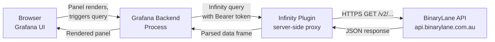
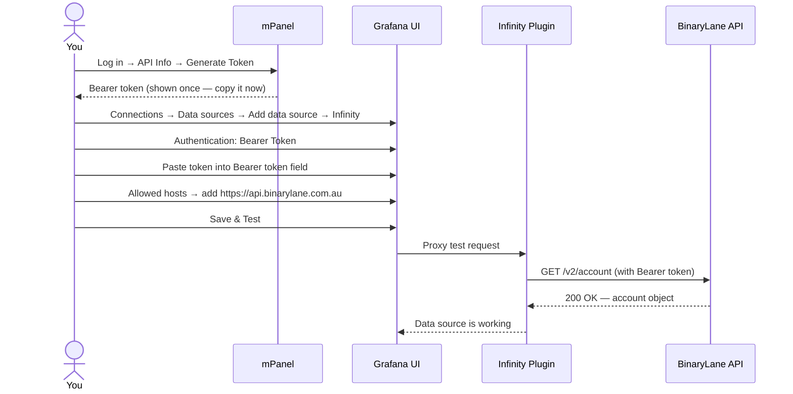
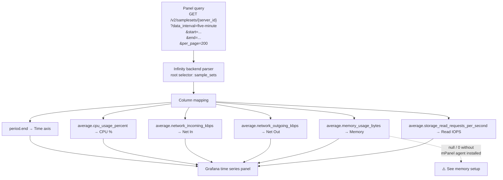
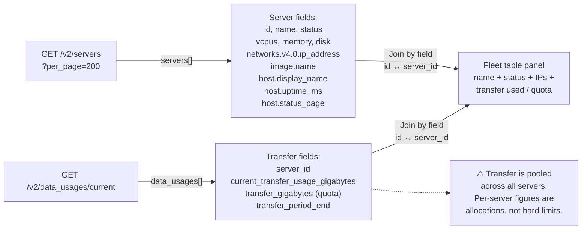
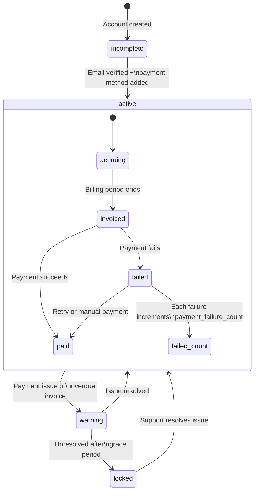
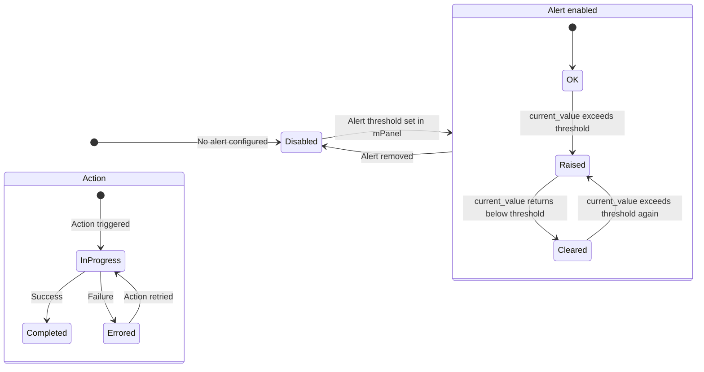
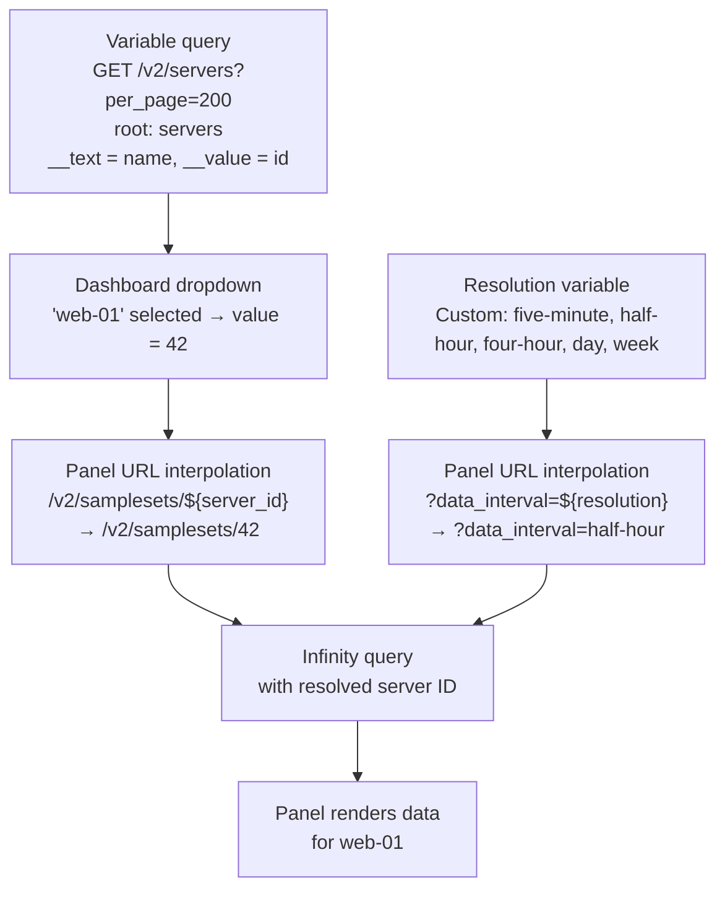
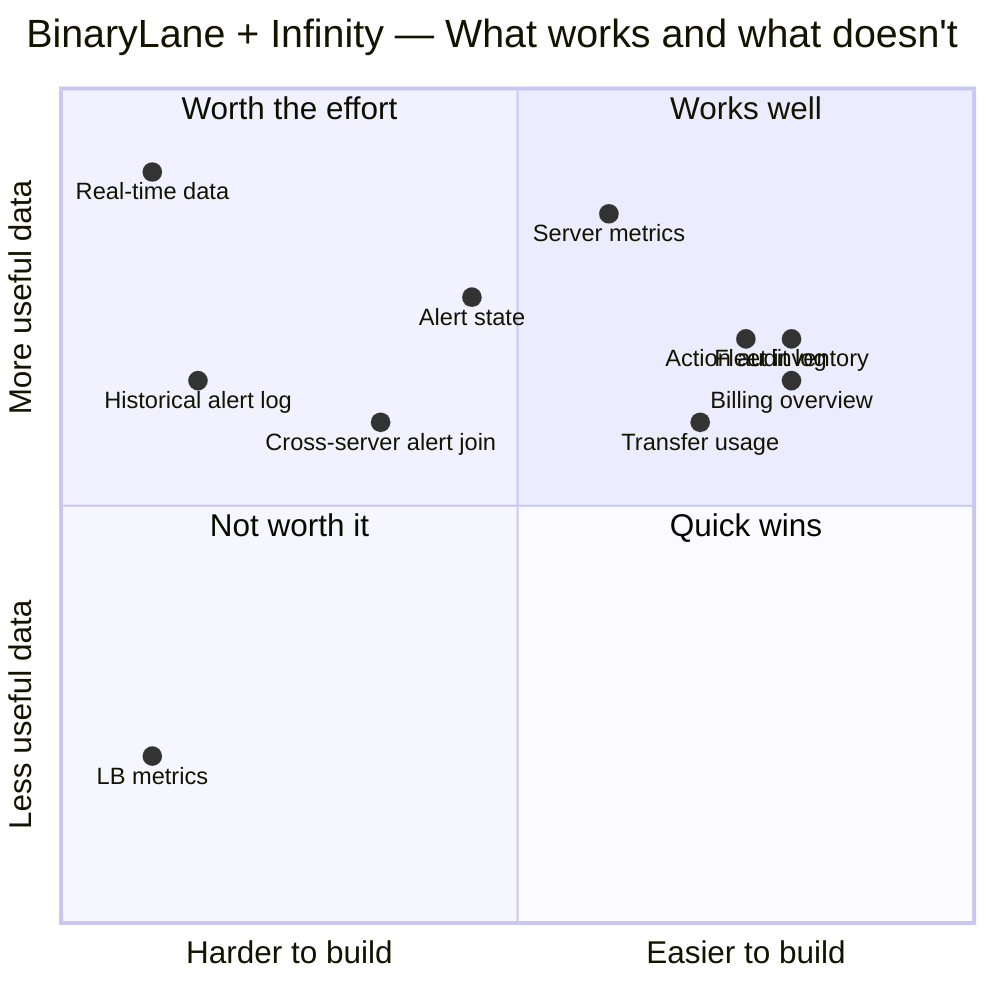

# Tutorial Documentation Suite Implementation Plan

> **For agentic workers:** REQUIRED SUB-SKILL: Use superpowers:subagent-driven-development (recommended) or superpowers:executing-plans to implement this plan task-by-task. Steps use checkbox (`- [ ]`) syntax for tracking.

**Goal:** Write a task-oriented documentation suite teaching BinaryLane customers what they can and cannot monitor via the BL API + Grafana Infinity datasource.

**Architecture:** Nine markdown files in `docs/` plus an updated `README.md`. Each tutorial doc follows the shape: capabilities → Mermaid data-flow diagram → build-it steps → limitations. A consolidated `08-limitations.md` cross-references all constraints. No build tooling — renders on GitHub as-is.

**Tech Stack:** Markdown, Mermaid (GitHub-native rendering), Grafana Infinity datasource v2+, BinaryLane REST API v2.

---

## File Map

| Action | Path | Responsibility |
|--------|------|----------------|
| Create | `docs/index.md` | Navigation hub, prerequisites, "if you want X start here" routing |
| Create | `docs/01-how-it-works.md` | Infinity architecture, auth model, backend vs frontend parser |
| Create | `docs/02-setup.md` | Token generation, datasource config, connection test |
| Create | `docs/03-server-metrics.md` | Samplesets, time series panels, resolution system |
| Create | `docs/04-fleet-overview.md` | Server inventory, transfer pooling, cross-dataset joins |
| Create | `docs/05-billing.md` | Balance, charges, invoices, account status states |
| Create | `docs/06-alerts-actions.md` | Threshold alerts, action audit log |
| Create | `docs/07-variables-filters.md` | Variables, Infinity filters, Grafana transformations |
| Create | `docs/08-limitations.md` | Consolidated limitations reference |
| Modify | `README.md` | Add "Documentation" section pointing to `docs/index.md` |

---

## Task 1: `docs/index.md` — Navigation hub

**Files:**
- Create: `docs/index.md`

- [ ] **Step 1: Create `docs/index.md`**

```markdown
# BinaryLane Grafana — Documentation

This documentation teaches you how to use the BinaryLane API with the
[Grafana Infinity datasource](https://grafana.com/grafana/plugins/yesoreyeram-infinity-datasource/)
to build dashboards for your BinaryLane account — and where the limits are.

## Prerequisites

- A running Grafana instance (self-hosted or Grafana Cloud)
- A BinaryLane account with at least one server
- A BinaryLane API token ([how to generate one](02-setup.md#generating-an-api-token))

## What you can monitor

| Area | Doc | What you get |
|------|-----|--------------|
| How it works | [01-how-it-works.md](01-how-it-works.md) | Architecture, auth, Infinity internals |
| Setup | [02-setup.md](02-setup.md) | Datasource config, connection testing |
| Server metrics | [03-server-metrics.md](03-server-metrics.md) | CPU, network, storage, memory per server |
| Fleet overview | [04-fleet-overview.md](04-fleet-overview.md) | All servers, inventory, transfer pooling |
| Billing | [05-billing.md](05-billing.md) | Balance, charges, invoices, account status |
| Alerts & Actions | [06-alerts-actions.md](06-alerts-actions.md) | Threshold alerts, action audit log |
| Variables & Filters | [07-variables-filters.md](07-variables-filters.md) | Dropdowns, filters, transformations |
| Limitations | [08-limitations.md](08-limitations.md) | Full constraints reference |

## Where to start

- **New to this setup?** → [01-how-it-works.md](01-how-it-works.md)
- **Ready to configure the datasource?** → [02-setup.md](02-setup.md)
- **Want to monitor a specific server?** → [03-server-metrics.md](03-server-metrics.md)
- **Want an account-wide view?** → [04-fleet-overview.md](04-fleet-overview.md)
- **Want to track spend?** → [05-billing.md](05-billing.md)
- **Want to track alerts or audit changes?** → [06-alerts-actions.md](06-alerts-actions.md)
- **Something not working?** → [08-limitations.md](08-limitations.md)
```

- [ ] **Step 2: Commit**

```bash
git add docs/index.md
git commit -m "docs: add documentation index"
```

---

## Task 2: `docs/01-how-it-works.md` — Architecture

**Files:**
- Create: `docs/01-how-it-works.md`

- [ ] **Step 1: Create `docs/01-how-it-works.md`**

```markdown
# How It Works

The BinaryLane Grafana integration uses the
[Infinity datasource plugin](https://grafana.com/grafana/plugins/yesoreyeram-infinity-datasource/)
to query the BinaryLane REST API directly from Grafana — no agent, no exporter, no
intermediate database.

## Architecture



**Key point:** Infinity is a *server-side proxy*. The HTTP requests to the BinaryLane API
are made by your Grafana backend process, not by the user's browser. This means:

- The API token never leaves your Grafana server
- CORS is not a concern
- The BinaryLane API must be reachable from your Grafana host (not the user's machine)

## Authentication

Authentication is configured once at the datasource level using a Bearer token.
Individual panel queries do not include auth headers — Infinity adds the token
automatically to every proxied request.

The token has full account access. Treat it like a password. See
[02-setup.md](02-setup.md) for how to generate one with minimal permissions.

## Backend parser vs frontend parser

Infinity has two JSON parsers. **Always use the backend parser** for BinaryLane data.

| | Backend parser | Frontend parser |
|---|---|---|
| Runs in | Grafana server process | User's browser |
| Auth | Injected automatically | Not injected |
| Nested field access | Dot notation (`networks.v4.0.ip_address`) | Dot or bracket |
| Bracket notation | **Not supported** | Supported |
| Performance | Better for large responses | Fine for small |

To select it: in any panel's Infinity query config, set **Parser → Backend**.

## BinaryLane API basics

- Base URL: `https://api.binarylane.com.au`
- All endpoints are under `/v2/`
- All responses are JSON
- Paginated endpoints return a wrapper object containing an array plus metadata
- Maximum `per_page` is **200** — you cannot retrieve more than 200 items per request
- Time-series data (`/v2/samplesets`) uses ISO 8601 datetimes for `start`/`end` params

## What the API does not provide

- No WebSocket or streaming endpoints — all data is request/response
- No push notifications or webhooks (relevant to Grafana alerting — see [08-limitations.md](08-limitations.md))
- Minimum time-series resolution is 5 minutes — there is no real-time data
```

- [ ] **Step 2: Commit**

```bash
git add docs/01-how-it-works.md
git commit -m "docs: add how-it-works architecture doc"
```

---

## Task 3: `docs/02-setup.md` — Datasource setup

**Files:**
- Create: `docs/02-setup.md`

- [ ] **Step 1: Create `docs/02-setup.md`**

```markdown
# Setup

## Generating an API token

1. Log in to [mPanel](https://home.binarylane.com.au)
2. Click your name (top right) → **API Info**
3. Click **Generate New Token**
4. Copy the token — it will not be shown again

The token grants full account access. Store it in a secret manager or environment
variable — never commit it to source control.

## Provisioning flow



## Option A — Docker Compose (quickest)

Clone this repo and create a `.env` file:

```bash
cp .env.example .env
# Edit .env and set BL_API_TOKEN=your-token-here
```

Start the stack:

```bash
docker compose up -d
```

Open [http://localhost:3000](http://localhost:3000) — login `admin` / `admin` (change
this before exposing to a network). The Infinity datasource and all four dashboards
are provisioned automatically on first boot.

**Before exposing to a network**, set strong admin credentials by adding these to your
`.env` and restarting:

```bash
GF_SECURITY_ADMIN_USER=youradmin
GF_SECURITY_ADMIN_PASSWORD=a-strong-password
```

## Option B — Manual install into existing Grafana

### 1. Install the Infinity plugin

```bash
grafana-cli plugins install yesoreyeram-infinity-datasource
systemctl restart grafana-server
```

Or in Docker, add to `GF_INSTALL_PLUGINS`:

```yaml
environment:
  GF_INSTALL_PLUGINS: yesoreyeram-infinity-datasource
```

### 2. Provision the datasource

Copy `provisioning/datasources/binarylane.yaml` to your Grafana provisioning directory
and set `BL_API_TOKEN` in your environment before restarting Grafana:

```bash
cp provisioning/datasources/binarylane.yaml /etc/grafana/provisioning/datasources/
export BL_API_TOKEN=your-token-here
systemctl restart grafana-server
```

Or configure manually in the UI:
- **Connections → Data sources → Add new → Infinity**
- Name: `BinaryLane`
- Authentication: `Bearer Token`
- Token: your API token
- Allowed hosts: `https://api.binarylane.com.au`
- Save & Test

### 3. Import dashboards

```bash
cp provisioning/dashboards/binarylane.yaml /etc/grafana/provisioning/dashboards/
cp dashboards/*.json /var/lib/grafana/dashboards/
systemctl restart grafana-server
```

Or import each JSON via **Dashboards → Import → Upload JSON file**.

## Testing your connection

After setup, verify the datasource works with a quick manual query:

1. Open the Infinity datasource → **Explore**
2. Set: Type = JSON, Source = URL
3. URL: `https://api.binarylane.com.au/v2/account`
4. Root selector: `account`
5. Parser: Backend
6. Click **Run query**

You should see your account fields (`email`, `status`, etc.) in the result table.

If you get an error, check:
- Token is correct: `curl -H "Authorization: Bearer YOUR_TOKEN" https://api.binarylane.com.au/v2/account`
- Allowed hosts includes `https://api.binarylane.com.au` (exact string, with protocol)
- Your Grafana host has outbound HTTPS access to `api.binarylane.com.au`
```

- [ ] **Step 2: Commit**

```bash
git add docs/02-setup.md
git commit -m "docs: add setup and provisioning guide"
```

---

## Task 4: `docs/03-server-metrics.md` — Per-server performance

**Files:**
- Create: `docs/03-server-metrics.md`

- [ ] **Step 1: Create `docs/03-server-metrics.md`**

```markdown
# Server Metrics

Per-server performance data comes from the `/v2/samplesets/{server_id}` endpoint.
It provides time-averaged CPU, network, storage, memory, and disk metrics.

## What you can monitor

| Metric | API field | Notes |
|--------|-----------|-------|
| CPU usage | `average.cpu_usage_percent` | Avg across all vCPUs; 100% = fully saturated |
| Network in | `average.network_incoming_kbps` | Inbound kbps |
| Network out | `average.network_outgoing_kbps` | Outbound kbps |
| Disk read throughput | `average.storage_read_kbps` | kbps |
| Disk write throughput | `average.storage_write_kbps` | kbps |
| Disk read IOPS | `average.storage_read_requests_per_second` | Requests/s |
| Disk write IOPS | `average.storage_write_requests_per_second` | Requests/s |
| Memory usage | `average.memory_usage_bytes` | **Requires mPanel agent — see below** |
| Peak memory | `maximum_memory_megabytes` | Highest MB in the sample period |
| Peak disk | `maximum_storage_gigabytes` | Highest GB in the sample period |
| Sample period end | `period.end` | Timestamp — use as the time axis |

## How the data flows



## Building a time series panel

In a new panel, set the datasource to **BinaryLane**, then configure the Infinity query:

| Field | Value |
|-------|-------|
| Type | JSON |
| Source | URL |
| Format | Time series |
| URL | `https://api.binarylane.com.au/v2/samplesets/${server_id}?data_interval=${resolution}&start=${__from:date:iso}&end=${__to:date:iso}&per_page=200` |
| Root selector | `sample_sets` |
| Parser | Backend |

Add columns:

| Selector | As (column name) | Type |
|----------|-----------------|------|
| `period.end` | Time | Timestamp |
| `average.cpu_usage_percent` | CPU % | Number |
| `average.network_incoming_kbps` | Net In | Number |
| `average.network_outgoing_kbps` | Net Out | Number |
| `average.storage_read_kbps` | Disk Read | Number |
| `average.storage_write_kbps` | Disk Write | Number |
| `average.storage_read_requests_per_second` | Read IOPS | Number |
| `average.storage_write_requests_per_second` | Write IOPS | Number |
| `average.memory_usage_bytes` | Memory | Number |

The `${server_id}` and `${resolution}` references are Grafana template variables —
see [07-variables-filters.md](07-variables-filters.md) for how to set these up.

## Understanding resolution and the 200-sample cap

The `data_interval` parameter controls the time granularity of each data point.
The API returns at most **200 samples per request** (`per_page=200`). This creates
a fixed time window for each resolution setting:

| `data_interval` | Sample interval | 200 samples covers |
|-----------------|-----------------|-------------------|
| `five-minute` | 5 minutes | ~16.7 hours |
| `half-hour` | 30 minutes | ~4.2 days |
| `four-hour` | 4 hours | ~33 days |
| `day` | 1 day | ~6.7 months |
| `week` | 1 week | ~3.8 years |

**If your Grafana time range is wider than the coverage for your chosen resolution,
the panel will only show data for the first portion of the range.** There is no
automatic pagination — you get one page of 200.

Suggested combinations:

| Grafana time range | Use resolution |
|--------------------|---------------|
| Last 1–12 hours | `five-minute` |
| Last 1–4 days | `half-hour` |
| Last 2–5 weeks | `four-hour` |
| Last 3–6 months | `day` |
| Historical | `week` |

## Memory metrics — mPanel agent required

`average.memory_usage_bytes` will be `null` or `0` for every sample unless the
**mPanel Memory Graph** agent is installed on the server. The agent runs a cron job
every few minutes and sends a UDP packet on port 21000 to BinaryLane's collection endpoint.

### Install on Linux

```bash
wget http://mirror.binarylane.com.au/tools/mpanel-memory-graph.tar.gz
sudo tar xfv mpanel-memory-graph.tar.gz -C /
rm mpanel-memory-graph.tar.gz
```

**Debian 12 only** — cron is not in the base image:

```bash
sudo apt install cron
sudo systemctl enable --now cron
```

If you have iptables rules blocking outbound traffic:

```bash
iptables -I OUTPUT -p udp --dport 21000 -j ACCEPT
iptables-save > /etc/iptables/rules.v4
```

### Install on Windows

1. Download [mPanelMemoryGraph.msi](http://mirror.binarylane.com.au/tools/mpanelmemorygraph.msi)
2. Requires .NET Framework 2.0+
3. Run the installer — creates a Windows service

Firewall rule:
```
netsh advfirewall firewall add rule name="mPanel Memory Graph" action=allow dir=out protocol=UDP remoteport=21000
```

Allow up to 15 minutes for data to appear after installation.

### Verify

```bash
systemctl status cron
ls -la /usr/local/bin/mpanel-memory-graph /etc/cron.d/mpanel-memory-graph
sudo /usr/local/bin/mpanel-memory-graph
```

## Limitations

- **5-minute minimum resolution.** There is no finer-grained data. Dashboard refresh
  intervals shorter than 5 minutes will not produce new data.
- **200 samples per query, no automatic pagination.** If you need data beyond what
  200 samples at a given resolution covers, you must switch to a coarser resolution.
  There is no workaround for seeing both high resolution and a long time range
  simultaneously.
- **Memory requires the mPanel agent.** Without it, all memory panels show no data.
  This cannot be worked around — the metric simply does not exist in the API without
  the agent reporting it.
- **No per-core CPU breakdown.** `cpu_usage_percent` is the average across all vCPUs.
  Individual core metrics are not available.
- **No disk space time series.** `maximum_storage_gigabytes` gives the peak for a
  sample period, not a continuous time series of disk utilisation. Historical disk
  growth cannot be charted.
```

- [ ] **Step 2: Commit**

```bash
git add docs/03-server-metrics.md
git commit -m "docs: add server metrics tutorial"
```

---

## Task 5: `docs/04-fleet-overview.md` — Fleet inventory

**Files:**
- Create: `docs/04-fleet-overview.md`

- [ ] **Step 1: Create `docs/04-fleet-overview.md`**

```markdown
# Fleet Overview

The fleet overview uses two endpoints: `/v2/servers` for inventory and
`/v2/data_usages/current` for transfer usage across all servers.

## What you can monitor

- All servers in the account: name, status, vCPUs, RAM, disk, OS, IP addresses
- Host-level metadata: display name, uptime, maintenance status page URL
- Current period data transfer usage and quota per server
- Account-wide totals: vCPU count, total RAM, total disk, total transfer

## How the data flows



## Building the server inventory panel

Configure an Infinity query:

| Field | Value |
|-------|-------|
| Type | JSON |
| Source | URL |
| Format | Table |
| URL | `https://api.binarylane.com.au/v2/servers?per_page=200` |
| Root selector | `servers` |
| Parser | Backend |

Add columns:

| Selector | As | Type |
|----------|----|------|
| `id` | ID | Number |
| `name` | Name | String |
| `status` | Status | String |
| `vcpus` | vCPUs | Number |
| `memory` | RAM (MB) | Number |
| `disk` | Disk (GB) | Number |
| `image.name` | OS | String |
| `networks.v4.0.ip_address` | IP | String |
| `host.display_name` | Host | String |
| `host.uptime_ms` | Host Uptime | Number |
| `host.status_page` | Maintenance | String |

> **Important:** Use dot notation for nested fields (`networks.v4.0.ip_address`).
> Bracket notation (`networks[v4][0]`) is not supported by the Infinity backend parser.

`host.status_page` is non-null only when the host is under maintenance — you can use
a cell colour override (non-empty = yellow) as a visual maintenance indicator.

## Building the transfer usage panel

Add a second query target (or a separate panel) for transfer data:

| Field | Value |
|-------|-------|
| Type | JSON |
| Source | URL |
| Format | Table |
| URL | `https://api.binarylane.com.au/v2/data_usages/current` |
| Root selector | `data_usages` |
| Parser | Backend |

Columns:

| Selector | As | Type |
|----------|----|------|
| `server_id` | ID | Number |
| `current_transfer_usage_gigabytes` | Used GB | Number |
| `transfer_gigabytes` | Quota GB | Number |
| `transfer_period_end` | Period End | String |

To calculate transfer percentage, add a **Calculate field** transform:

```
Mode:   Binary operation
Left:   Used GB
Op:     /
Right:  Quota GB
Alias:  Transfer %
```

Then a second **Calculate field** transform to multiply by 100 for display.

## Joining server names to transfer data

Use the **Join by field** transformation to merge the two query results into one table.
Both queries must be in the same panel as separate targets (A and B):

```
Transform: Join by field
Field:     ID        (present in both — servers.id and data_usages.server_id)
Mode:      OUTER     (keeps servers with no transfer data)
```

This gives you a single table with name, status, IPs, and transfer figures side by side.

## Understanding transfer pooling

BinaryLane pools data transfer across all servers in your account. A server that uses
less than its allocated quota offsets one that exceeds it. The per-server
`transfer_gigabytes` figure is an *allocation*, not a hard cap — exceeding it does not
immediately incur charges if other servers in the pool have spare capacity.

The `current_transfer_usage_gigabytes` figure reflects actual usage for the current
billing period. The pool resets at the start of each period.

## Limitations

- **No historical inventory.** There is no API endpoint for server state at a past
  point in time. You can only see the current state of your fleet.
- **No load balancer metrics.** Load balancers appear in `/v2/load_balancers` but have
  no equivalent of the samplesets endpoint — only configuration data (rules, target
  servers) is available, not traffic or health metrics.
- **IP address field is `networks.v4.0.ip_address`.** This assumes the first IPv4
  address. Servers with multiple IPv4 addresses will only show the first. Failover IPs
  are in a separate `failover_ips[]` array and require a separate query or transformation
  to display.
- **`host.status_page` is a URL, not a boolean.** It is `null` when there is no
  maintenance, and a URL string during maintenance events. Use "is not null" cell
  overrides rather than a boolean check.
- **Transfer pooling means per-server % > 100 is normal** if a server is using more
  than its allocation but the pool has spare capacity. Do not alert on per-server
  transfer % alone without accounting for pool state.
```

- [ ] **Step 2: Commit**

```bash
git add docs/04-fleet-overview.md
git commit -m "docs: add fleet overview tutorial"
```

---

## Task 6: `docs/05-billing.md` — Billing & account

**Files:**
- Create: `docs/05-billing.md`

- [ ] **Step 1: Create `docs/05-billing.md`**

```markdown
# Billing & Account

The billing area covers account status, available credit, current unbilled charges,
and invoice history. All billing data is read-only — you can monitor and alert on it
but not modify it through Grafana.

## What you can monitor

- Account status (active / warning / locked / incomplete)
- 2FA enabled/disabled (security signal)
- Available credit balance (AU$)
- Unbilled total for the current period (AU$)
- Itemised unbilled charges (description, amount, ongoing vs pending)
- Invoice history (amounts, tax, paid status, payment failure count, PDF links)
- Failed invoice count (blocks new service creation when > 0)

## Account status lifecycle



**`warning` and `locked` are urgent states** — locked accounts cannot create new
services. If your billing dashboard shows either of these, contact BinaryLane support.

## Building the account status panel

Use a Stat panel with a Threshold colour override:

| Field | Value |
|-------|-------|
| Type | JSON |
| Source | URL |
| Format | Table |
| URL | `https://api.binarylane.com.au/v2/account` |
| Root selector | `account` |
| JSON options | Root is not array: ✓ |
| Parser | Backend |

Columns to extract:

| Selector | As | Type |
|----------|----|------|
| `status` | Status | String |
| `two_factor_authentication_enabled` | 2FA | Boolean |
| `email` | Email | String |
| `email_verified` | Email Verified | Boolean |

For the Status Stat panel, add value mappings:
- `active` → green
- `incomplete` → yellow
- `warning` → orange
- `locked` → red

## Building the balance panel

| Field | Value |
|-------|-------|
| URL | `https://api.binarylane.com.au/v2/customers/my/balance` |
| Root selector | `balance` |
| JSON options | Root is not array: ✓ |
| Parser | Backend |

Key columns:

| Selector | As | Type |
|----------|----|------|
| `unbilled_total` | Unbilled (AU$) | Number |
| `available_credit` | Credit (AU$) | Number |
| `generated_at` | As of | String |

For the Unbilled stat panel, add thresholds:
- Base: green
- > 50: yellow
- > 200: red

Adjust these thresholds to match your typical spend.

## Building the unbilled charges table

The `charges[]` array is nested inside the balance response. Add a second query target
pointing to the same URL with root selector `balance.charges`:

| Field | Value |
|-------|-------|
| URL | `https://api.binarylane.com.au/v2/customers/my/balance` |
| Root selector | `balance.charges` |
| Parser | Backend |

Columns:

| Selector | As | Type |
|----------|----|------|
| `description` | Description | String |
| `total` | Amount (AU$) | Number |
| `ongoing` | Ongoing | Boolean |
| `created` | Created | String |

`ongoing: true` means the service is still running (charge will grow).
`ongoing: false` means the service ended and the charge is awaiting invoicing.

## Building the invoice history table

| Field | Value |
|-------|-------|
| URL | `https://api.binarylane.com.au/v2/customers/my/invoices?per_page=200` |
| Root selector | `invoices` |
| Parser | Backend |

Key columns:

| Selector | As | Type |
|----------|----|------|
| `invoice_number` | Invoice # | String |
| `amount` | Amount (AU$) | Number |
| `tax` | GST (AU$) | Number |
| `paid` | Paid | Boolean |
| `payment_failure_count` | Failures | Number |
| `created` | Created | String |
| `date_due` | Due | String |
| `invoice_download_url` | PDF | String |

Use a cell override on `invoice_download_url` to render it as a clickable link.

> **PDF links expire 24 hours after the API responds.** Refresh the panel to get a
> fresh link. Do not bookmark or store these URLs.

## Detecting failed invoices

Use a separate Stat panel querying the failed invoices endpoint:

| Field | Value |
|-------|-------|
| URL | `https://api.binarylane.com.au/v2/customers/my/unpaid-payment-failed-invoices` |
| Root selector | `invoices` |
| Parser | Backend |

Count the rows using a **Reduce** transformation (Count). Add a threshold:
- 0: green
- > 0: red

Failed invoices block new service creation. A non-zero count warrants immediate attention.

## Limitations

- **No Grafana alerting from billing data.** Infinity query results cannot directly
  trigger Grafana alerts. You can see the billing state on a dashboard but cannot
  configure "alert me when unbilled_total exceeds $X" via native Grafana alerting.
  Workaround: use a Grafana alert on a panel value if you have Grafana Cloud or
  an alerting backend, but this requires additional setup outside this stack.
- **Invoice PDF URLs expire in 24 hours.** These are pre-signed URLs generated at
  query time. There is no persistent link to invoices.
- **No payment method details.** `configured_payment_methods[]` is present in the
  account response but contains only method type (e.g. "card"), not card numbers
  or expiry dates.
- **No billing history before invoicing.** The charges array shows the *current period*
  only. Previous period charges exist as invoices, not as the granular charges array.
- **`unbilled_total` updates with a short delay.** It is not a real-time figure —
  BinaryLane recalculates it periodically. Very recent charges may not be reflected
  immediately.
```

- [ ] **Step 2: Commit**

```bash
git add docs/05-billing.md
git commit -m "docs: add billing and account tutorial"
```

---

## Task 7: `docs/06-alerts-actions.md` — Alerts & actions

**Files:**
- Create: `docs/06-alerts-actions.md`

- [ ] **Step 1: Create `docs/06-alerts-actions.md`**

```markdown
# Alerts & Actions

## Threshold alerts

BinaryLane threshold alerts are configured per server and trigger when a metric
exceeds a set value. The API exposes current alert state — not a history of events.

### Alert types

| Type | Measures | Unit | Common use |
|------|----------|------|------------|
| `cpu` | Avg CPU % | % (0–100) | Sustained load detection |
| `storage-requests` | Avg combined IOPS | requests/s | Swap thrashing (high IOPS + memory exhaustion) |
| `network-incoming` | Inbound bandwidth | kbps | Possible DoS |
| `network-outgoing` | Outbound bandwidth | kbps | Possible compromise or spam |
| `data-transfer-used` | Monthly transfer used | % of quota | Billing protection |
| `storage-used` | Disk used | % of total | Full disk prevention |
| `memory-used` | Virtual memory used | % of RAM | > 100% = swap in use |

### Alert state lifecycle



### The two-endpoint alert model

There are two alert endpoints and you need both to build a useful panel:

| Endpoint | Returns | Use for |
|----------|---------|---------|
| `/v2/servers/threshold_alerts` | Array of `server_ids` (integers) | Count of servers currently breaching any alert |
| `/v2/servers/{id}/threshold_alerts` | Full alert details per server | Per-server alert type, threshold, current value, timestamps |

The first endpoint returns *only IDs* — no alert details, no metric values. To show
which alerts are active and for which servers, you must query the per-server endpoint
for each server, then join the results.

### Building the "servers exceeding alerts" stat panel

| Field | Value |
|-------|-------|
| URL | `https://api.binarylane.com.au/v2/servers/threshold_alerts` |
| Root selector | `server_ids` |
| Parser | Backend |

Use a **Reduce** transformation (Count) and add a threshold: 0 = green, > 0 = red.

### Building the per-server threshold alerts table

Use the `${server_id}` variable (see [07-variables-filters.md](07-variables-filters.md)):

| Field | Value |
|-------|-------|
| URL | `https://api.binarylane.com.au/v2/servers/${server_id}/threshold_alerts` |
| Root selector | `threshold_alerts` |
| Parser | Backend |

Columns:

| Selector | As | Type |
|----------|----|------|
| `alert_type` | Type | String |
| `enabled` | Enabled | Boolean |
| `value` | Threshold | Number |
| `current_value` | Current | Number |
| `last_raised` | Last Raised | String |
| `last_cleared` | Last Cleared | String |

Add a cell colour override: rows where `current_value` > `value` → red.

## Actions (audit log)

Actions record every operation performed on your account — server creation, resizing,
reboots, image creation, and more. They also track in-progress operations with a
progress percentage.

### Action status values

| Status | Meaning |
|--------|---------|
| `in-progress` | Operation running — check `progress.percent_complete` |
| `completed` | Operation finished successfully |
| `errored` | Operation failed — check `result_data` for reason |

### Building the recent actions table

| Field | Value |
|-------|-------|
| URL | `https://api.binarylane.com.au/v2/actions?per_page=200` |
| Root selector | `actions` |
| Parser | Backend |

Columns:

| Selector | As | Type |
|----------|----|------|
| `id` | ID | Number |
| `type` | Type | String |
| `status` | Status | String |
| `title` | Title | String |
| `resource_type` | Resource | String |
| `started_at` | Started | String |
| `completed_at` | Completed | String |
| `progress.percent_complete` | Progress % | Number |

Add a cell override on `status`:
- `in-progress` → blue
- `completed` → green
- `errored` → red

For in-progress actions, `progress.percent_complete` gives a 0–100 value you can
render as an inline bar using the **Bar gauge** cell display mode.

### Per-server actions

To show actions for only the selected server, use:

```
URL: https://api.binarylane.com.au/v2/servers/${server_id}/actions?per_page=200
Root selector: actions
```

Same column setup as the account-wide actions table.

## Limitations

- **No alert history.** The threshold alerts API returns only the *current* state —
  `last_raised` and `last_cleared` timestamps are the only historical data. There is
  no event log of alert transitions. You cannot chart "how many times did this server
  breach CPU threshold this week."
- **No push notifications from Grafana.** Alert state is pulled on each dashboard
  refresh. There is no way to have Grafana send a notification when an alert is raised
  without additional tooling (e.g., polling via external script or Grafana alerting
  rules on panel values).
- **Cross-server alert joining is manual.** The `/v2/servers/threshold_alerts` endpoint
  gives you a list of server IDs. Getting the details requires one API call per server.
  Infinity cannot fan out one query into N sub-queries. Workaround: the per-server
  threshold alerts table in the dashboard uses a server selector variable — you check
  one server at a time.
- **Actions are limited to 200 per query.** For accounts with high action volume,
  the audit log panel will only show the most recent 200 actions. There is no
  pagination within a single Infinity query.
- **`result_data` field is unstructured.** The content varies by action type and is
  not consistently parseable as a column value. Treat it as a freetext detail field.
```

- [ ] **Step 2: Commit**

```bash
git add docs/06-alerts-actions.md
git commit -m "docs: add alerts and actions tutorial"
```

---

## Task 8: `docs/07-variables-filters.md` — Variables, filters, transforms

**Files:**
- Create: `docs/07-variables-filters.md`

- [ ] **Step 1: Create `docs/07-variables-filters.md`**

```markdown
# Variables, Filters & Transformations

## Dashboard variables

Grafana template variables let you build panels that adapt to user selection —
for example, switching between servers without duplicating panels.

### How variables feed into panel URLs



### Server dropdown variable

Create a new dashboard variable:

| Setting | Value |
|---------|-------|
| Type | Query |
| Name | `server_id` |
| Data source | BinaryLane |
| Query type | JSON |
| Source | URL |
| URL | `https://api.binarylane.com.au/v2/servers?per_page=200` |
| Root selector | `servers` |
| Parser | Backend |

Add two columns:

| Selector | Column name | Type |
|----------|-------------|------|
| `name` | `__text` | String |
| `id` | `__value` | String |

`__text` is the label shown in the dropdown. `__value` is the value injected into
panel URLs as `${server_id}`. This is an Infinity convention (Infinity ≥ 2.x required).

### Resolution variable

Create a second variable:

| Setting | Value |
|---------|-------|
| Type | Custom |
| Name | `resolution` |
| Values | `five-minute : 5 Minutes, half-hour : 30 Minutes, four-hour : 4 Hours, day : 1 Day, week : 1 Week` |

The format is `value : label` pairs. The `value` half is what gets injected into the
panel URL as `${resolution}`. Set the default to `five-minute` or `half-hour` depending
on your typical time range.

## Infinity filter syntax

Infinity's backend parser supports client-side filtering of JSON responses. Filters
apply after the API responds — they do not change the API request.

```json
"filters": [
  { "field": "status", "operator": "equals",   "value": "active" },
  { "field": "status", "operator": "equals",   "value": "in-progress" }
]
```

### Supported operators

| Operator | Behaviour |
|----------|-----------|
| `equals` | Exact match |
| `not_equals` | Exclude exact match |
| `contains` | Substring match |
| `not_contains` | Exclude substring match |
| `starts_with` | Prefix match |
| `ends_with` | Suffix match |

### OR vs AND

Multiple filters on the same Infinity target are **OR'd** together. The example above
returns rows where status is `active` OR `in-progress`.

For AND logic (rows where field A equals X AND field B equals Y), you need two
separate Infinity targets plus a **Join by field** or **Filter by value** Grafana
transformation.

## Common Grafana transformations

### Calculate transfer percentage

The BinaryLane API returns raw GB values. To calculate a percentage:

1. Add **Calculate field** transformation:
   - Mode: Binary operation
   - Left field: `Used GB`
   - Operation: `/`
   - Right field: `Quota GB`
   - Alias: `Transfer Ratio`

2. Add a second **Calculate field** transformation:
   - Mode: Binary operation
   - Left field: `Transfer Ratio`
   - Operation: `*`
   - Right: 100 (constant)
   - Alias: `Transfer %`

### Join server names to other datasets

Any dataset that contains a `server_id` column can be joined to the servers list
(which has `id` and `name`) using **Join by field**:

| Setting | Value |
|---------|-------|
| Field | `id` (from servers query) |
| Mode | OUTER (keeps rows without a match) |

This merges the two data frames on matching server ID, giving you `name` alongside
whatever the second dataset provides (transfer usage, alert state, etc.).

### Filter in-progress actions

To show only in-progress actions in a panel, add a **Filter by value** transformation:

| Setting | Value |
|---------|-------|
| Field | `status` |
| Type | Filter by value |
| Match | equals |
| Value | `in-progress` |

## Limitations

- **Infinity filters are client-side.** They filter the response Grafana has already
  received — they do not add query parameters to the API request. You always fetch all
  results (up to `per_page=200`) and filter locally. This is fine for most BL datasets,
  which are small.
- **Variable queries count as API calls.** Each variable refresh (on dashboard load or
  refresh) triggers an API request to populate the dropdown. With many variables and
  frequent refresh, this adds up. The server list variable is the main one; avoid adding
  unnecessary variable queries.
- **`__text` / `__value` require Infinity ≥ 2.x.** Older versions of the plugin use
  different column name conventions for variable mapping. If your dropdown shows raw
  JSON instead of server names, check your plugin version.
```

- [ ] **Step 2: Commit**

```bash
git add docs/07-variables-filters.md
git commit -m "docs: add variables, filters, and transformations guide"
```

---

## Task 9: `docs/08-limitations.md` — Consolidated limitations

**Files:**
- Create: `docs/08-limitations.md`

- [ ] **Step 1: Create `docs/08-limitations.md`**

```markdown
# Limitations

A consolidated reference of every known constraint when using the BinaryLane API
with Grafana Infinity. Each entry links to the relevant tutorial for context.

## Capability overview



## Performance metrics

| Constraint | Detail | Workaround |
|------------|--------|------------|
| **5-minute minimum resolution** | The finest `data_interval` is `five-minute`. Refreshing dashboards more frequently than 5 minutes produces no new data. | Set refresh intervals to 5m or longer. |
| **200 samples per query** | `per_page=200` is the API maximum. You cannot retrieve more data points in a single request. | Switch to a coarser `data_interval` to cover a wider time range. See [resolution table](03-server-metrics.md#understanding-resolution-and-the-200-sample-cap). |
| **No automatic pagination** | Infinity sends one request per panel query. There is no built-in way to paginate across multiple pages. | Coarser resolution is the only option for wide time ranges. |
| **Memory requires mPanel agent** | `average.memory_usage_bytes` is null/0 without the agent installed and reporting. | Install the [mPanel Memory Graph agent](03-server-metrics.md#memory-metrics--mpanel-agent-required) on each server. |
| **No per-core CPU** | Only average CPU across all vCPUs is available. | Not available in the API. |
| **No disk usage time series** | Disk usage is not tracked as a continuous time series. Only `maximum_storage_gigabytes` per sample period is available. | Not available in the API. |

## Fleet

| Constraint | Detail | Workaround |
|------------|--------|------------|
| **No historical inventory** | `/v2/servers` returns current state only. You cannot query what your fleet looked like last month. | Not available in the API. |
| **No load balancer metrics** | `/v2/load_balancers` returns configuration only — no traffic, health, or connection data. | Not available in the API. |
| **Single IPv4 shown** | `networks.v4.0.ip_address` returns the first IPv4 only. Failover IPs require a separate query against `failover_ips[]`. | Add a second Infinity target for failover IPs and join. |
| **Transfer pooling** | Per-server transfer % can exceed 100 legitimately if the pool has spare capacity. | Show raw GB figures alongside percentage; document pooling behaviour. See [transfer pooling](04-fleet-overview.md#understanding-transfer-pooling). |

## Billing

| Constraint | Detail | Workaround |
|------------|--------|------------|
| **No Grafana alerting** | Infinity query results cannot natively trigger Grafana alerts. You cannot alert on "unbilled total > $X". | Requires Grafana alerting backend + alert rules on panel values — out of scope for this stack. |
| **Invoice PDF URLs expire in 24h** | `invoice_download_url` and `invoice_view_url` are pre-signed and expire 24 hours after the API call. | Refresh the panel to generate a fresh link. Do not store or bookmark these URLs. |
| **Current period charges only** | The `charges[]` array covers the current billing period only. Prior period charges are in the invoices list, not as granular charge items. | Query the invoices endpoint for historical amounts. |
| **No payment method details** | Only payment method type is exposed (e.g. "card"), not card details. | By design — PCI compliance. |
| **Unbilled total has a delay** | BinaryLane recalculates this periodically. Very recent usage may not appear immediately. | Set the billing dashboard refresh to 10m or longer. |

## Alerts & Actions

| Constraint | Detail | Workaround |
|------------|--------|------------|
| **No alert history** | The threshold alerts API returns current state only. `last_raised` and `last_cleared` are the only historical signals — no event log of transitions. | Not available in the API. |
| **Cross-server alert join is manual** | `/v2/servers/threshold_alerts` returns server IDs only. Getting alert details requires one API call per server. Infinity cannot fan out. | Use a server selector variable and view one server at a time. |
| **No push from Grafana** | Alert state is polled on dashboard refresh. Grafana cannot receive a push notification when an alert is raised. | External polling script, or Grafana alerting rules on panel values. |
| **Actions capped at 200** | No pagination within a single Infinity query. High-volume accounts will only see the most recent 200 actions. | Not solvable within Infinity alone. |
| **`result_data` is unstructured** | Content varies by action type — not reliably parseable as a column. | Display as freetext or omit. |

## Infinity datasource

| Constraint | Detail | Workaround |
|------------|--------|------------|
| **Backend parser only** | Must use backend parser for auth injection. Frontend parser does not receive the Bearer token. | Always set Parser = Backend. See [how-it-works](01-how-it-works.md#backend-parser-vs-frontend-parser). |
| **Dot notation only for nested fields** | `networks.v4.0.ip_address` works. Bracket notation `networks[v4][0]` does not in the backend parser. | Use dot notation exclusively. |
| **Filters are client-side** | Infinity filters apply after the full API response is received. You always fetch up to 200 rows. | Acceptable for BL dataset sizes; not a performance concern in practice. |
| **OR filters only within a target** | Multiple filters on one target are OR'd. AND logic requires multiple targets + Grafana transformations. | See [variables-filters](07-variables-filters.md#or-vs-and). |
| **`__text`/`__value` require Infinity ≥ 2.x** | Older versions use different variable mapping conventions. | Update the Infinity plugin. |
```

- [ ] **Step 2: Commit**

```bash
git add docs/08-limitations.md
git commit -m "docs: add consolidated limitations reference"
```

---

## Task 10: Update `README.md`

**Files:**
- Modify: `README.md`

- [ ] **Step 1: Add documentation section to README**

Find the existing `## Further Reading` section at the bottom of `README.md` and add
a `## Documentation` section directly above it:

```markdown
## Documentation

Full tutorial documentation is in [`docs/`](docs/):

| Doc | What it covers |
|-----|----------------|
| [How it works](docs/01-how-it-works.md) | Infinity architecture, auth, backend parser |
| [Setup](docs/02-setup.md) | Token, datasource config, connection testing |
| [Server metrics](docs/03-server-metrics.md) | CPU, network, storage, memory, resolution system |
| [Fleet overview](docs/04-fleet-overview.md) | Inventory, transfer pooling, joins |
| [Billing](docs/05-billing.md) | Balance, charges, invoices, account status |
| [Alerts & Actions](docs/06-alerts-actions.md) | Threshold alerts, action audit log |
| [Variables & Filters](docs/07-variables-filters.md) | Dropdowns, filters, transformations |
| [Limitations](docs/08-limitations.md) | Everything that doesn't work and why |
```

- [ ] **Step 2: Commit**

```bash
git add README.md
git commit -m "docs: link to documentation suite from README"
```

---

## Task 11: Push to GitHub

- [ ] **Step 1: Push all commits**

```bash
git push github main
```

Expected output:
```
To github.com:yokoszn/binarylane-grafana.git
   3cfa467..xxxxxxx  main -> main
```
